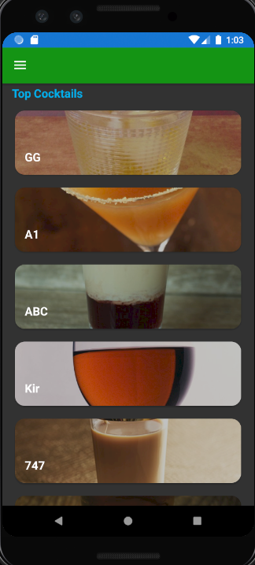
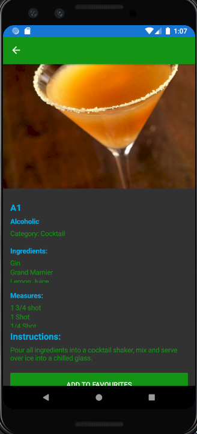

# Baramin
## Prof. Nathan Abourbih, Cloud Computing and Implement

## Overview
This application is a simple app attempted MVVM structure using Xamarin Forms. It retrieves alcohol beverages from TheCocktailDB api  
and displays them in a list for the user to click and retrieve details.(https://www.thecocktaildb.com/api.php)  

## Libraries
Libraries used in this project include:  
**FlowListView:** nested scroll views  
**SQLite:** database storage  
**AzureStorage:** database storage  

## Screenshots

## Pages  

### Home Page  
Displays a list of cocktails using an empty search endpoint. User can click on a list item to retrieve drink details.  
TODO: add title  

### Random Drink Page  
Displays a button on the middle of the screen that allows that user to click it to retrieve drink details of a random drink.  
TODO: styling  

### Drink Details
Displays the drink image, title, category, ingredients, measures, and instructions for whichever drink details were selected.  
TODO: make add to favourites save to azure storage instead of sqlite.  

### Favourites Page
Displays drinks that the user selected as a favourite in the list view. Long pressing on an item allows the user to delete it.  
TODO: Implement azure storage instead of sqlite.  

## Credits: Dave Nunez, random internet resources
